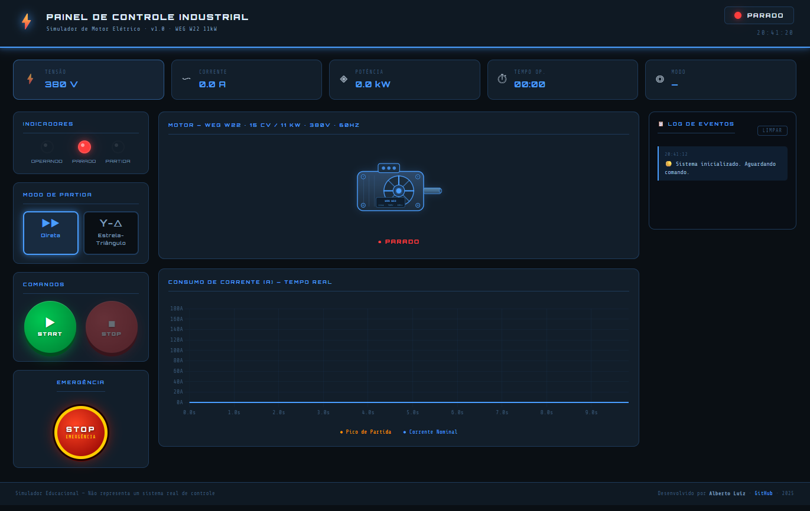

<div align="center">

# ⚡ Simulador de Painel de Comandos Elétricos

**Web App industrial interativo para simulação de partida de motor elétrico trifásico**

[](https://developer.mozilla.org/pt-BR/docs/Web/HTML)
[](https://developer.mozilla.org/pt-BR/docs/Web/CSS)
[](https://developer.mozilla.org/pt-BR/docs/Web/JavaScript)
[](https://www.chartjs.org/)
[](https://alberto2santos.github.io)
[](./LICENSE)

<br/>



<br/>

[🚀 Ver Demo Online](https://alberto2santos.github.io/simulador-painel-eletrico) &nbsp;·&nbsp;
[🐛 Reportar Bug](https://github.com/alberto2santos/simulador-painel-eletrico/issues) &nbsp;·&nbsp;
[💡 Sugerir Funcionalidade](https://github.com/alberto2santos/simulador-painel-eletrico/issues)

</div>

---

## 📋 Índice

- [Sobre o Projeto](#-sobre-o-projeto)
- [Funcionalidades](#-funcionalidades)
- [Tecnologias](#-tecnologias)
- [Estrutura do Projeto](#-estrutura-do-projeto)
- [Como Rodar](#-como-rodar-localmente)
- [Demo Online](#-demo-online)
- [Aprendizados](#-aprendizados)
- [Autor](#-autor)
- [Licença](#-licença)

---

## 💡 Sobre o Projeto

Este projeto simula, de forma **visual e educacional**, o comportamento elétrico de um motor
trifásico WEG W22 de 11kW durante a partida — reproduzindo com fidelidade as curvas de
corrente, estados de operação e lógica de proteção de um painel de comandos industrial real.

Desenvolvido como **projeto de portfólio** para demonstrar domínio em:

- Desenvolvimento front-end com JavaScript puro (sem frameworks)
- Simulação de lógica industrial (CLPs, painéis de controle)
- UX/UI com tema técnico e animações CSS avançadas
- Arquitetura de código modular e bem documentada

---

## ✨ Funcionalidades

### ⚙️ Modos de Partida
| Modo | Comportamento | Pico de Corrente |
|------|--------------|-----------------|
| **Partida Direta** | Energização imediata em plena tensão | ~7× a nominal |
| **Estrela-Triângulo (Y-Δ)** | Partida suave com comutação automática | ~2.5× a nominal |

### 🖥️ Interface
- **5 KPI cards** no topo com tensão, corrente, potência, tempo e modo em tempo real
- **Indicadores LED** animados — verde (operando), amarelo (partida), vermelho (parado/falha)
- **Motor SVG interativo** com animação de rotação e efeito de inércia real
- **Gráfico dinâmico** de consumo de corrente com curvas realistas via Chart.js
- **Relógio industrial** em tempo real no header
- **Design responsivo** — desktop, tablet e mobile

### 🛡️ Sistema de Proteções
- **Detecção de sobrecarga** — desliga o motor automaticamente ao ultrapassar o limite
- **Detecção de curto-circuito** — proteção imediata com alerta visual
- **Botão de Emergência (E-STOP)** — parada instantânea com bloqueio do painel
- **Reset de falha** — restaura o painel após confirmação do operador

### 📋 Log de Eventos
- Registro com **timestamp** de todos os eventos do sistema
- Histórico dos últimos 50 eventos com scroll automático
- Botão de limpeza do log

---

## 🛠️ Tecnologias

| Tecnologia | Versão | Finalidade |
|---|---|---|
| HTML5 | — | Estrutura semântica e acessibilidade |
| CSS3 | — | Animações, tema industrial, responsividade |
| JavaScript | ES6+ | Lógica de simulação e controle de estado |
| Chart.js | 4.4.0 | Gráfico dinâmico de corrente |
| Google Fonts | — | Orbitron + Share Tech Mono |

> **Zero dependências de build.** Nenhum bundler, nenhum framework. Abre direto no browser.

---

## 📁 Estrutura do Projeto

```
simulador-painel-eletrico/
│
├── index.html                      # Estrutura principal e marcação semântica
│
├── src/
│   ├── styles/
│   │   └── main.css                # Tema industrial, animações e responsividade
│   │
│   ├── js/
│   │   ├── main.js                 # Orquestrador — conecta todos os módulos
│   │   ├── chart-controller.js     # Controle do Chart.js e curvas de corrente
│   │   └── motor-controller.js     # Animação do motor com inércia simulada
│   │
│   └── utils/
│       ├── simulator.js            # Lógica das curvas de partida e parâmetros
│       ├── fault-simulator.js      # Detecção de sobrecarga e curto-circuito
│       └── event-logger.js         # Registro e exibição do log de eventos
│
└── assets/
    ├── motor-icon.svg              # Ícone SVG do motor WEG W22
    └── screenshot.png              # Preview para o README
```

---

## 🚀 Como Rodar Localmente

Não é necessário instalar nada. O projeto roda 100% no browser.

```bash
# 1. Clone o repositório
git clone https://github.com/alberto2santos/simulador-painel-eletrico.git

# 2. Entre na pasta
cd simulador-painel-eletrico

# 3. Abra no navegador
# Opção A — direto pelo terminal (macOS/Linux):
open index.html

# Opção B — Windows:
start index.html

# Opção C — recomendada: use a extensão Live Server do VS Code
# Clique com botão direito no index.html → "Open with Live Server"
```

> **Dica:** o Live Server do VS Code é recomendado pois recarrega automaticamente
> ao salvar qualquer arquivo do projeto.

---

## 🌐 Demo Online

O projeto está publicado via **GitHub Pages** e pode ser acessado sem instalação:

👉 **[alberto2santos.github.io/simulador-painel-eletrico](https://alberto2santos.github.io/simulador-painel-eletrico)**

---

## 👤 Autor

[](https://github.com/alberto2santos)

[](mailto:alberto.dos.santos93@gmail.com)

---

## 📜 Licença

Distribuído sob a licença **MIT**.
Sinta-se livre para usar, estudar, modificar e distribuir com os devidos créditos.

Veja o arquivo [LICENSE](./LICENSE) para mais detalhes.

---

<div align="center">

Feito por **Alberto Luiz**

</div>

