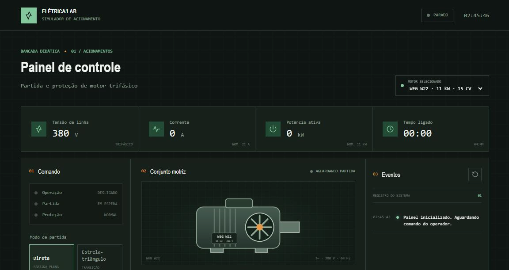
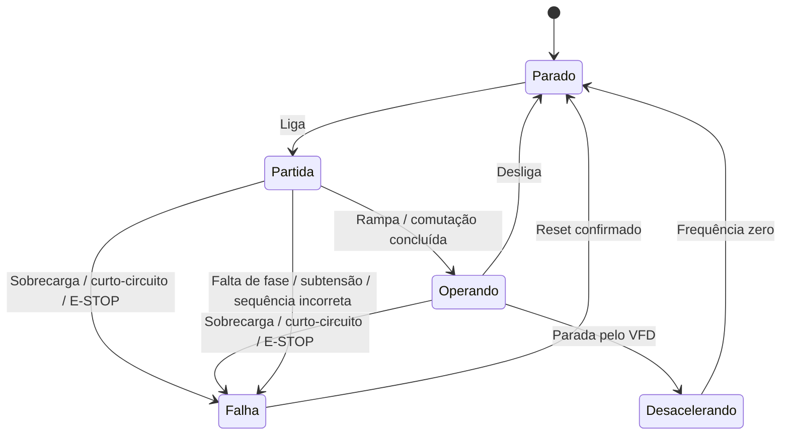

<div align="center">

# ⚡ Simulador de Painel de Comandos Elétricos

**Web app industrial interativo para simulação de partida e proteção de motores elétricos trifásicos**

[](https://react.dev/)
[](https://www.typescriptlang.org/)
[](https://vite.dev/)
[](https://zustand.docs.pmnd.rs/)
[](https://vitest.dev/)
[](https://www.chartjs.org/)
[](./LICENSE)

<br/>



<br/>

[🐛 Reportar bug](https://github.com/alberto2santos/simulador-painel-eletrico/issues) &nbsp;·&nbsp;
[💡 Sugerir funcionalidade](https://github.com/alberto2santos/simulador-painel-eletrico/issues)

</div>

---

## 📋 Índice

- [Sobre o projeto](#-sobre-o-projeto)
- [Funcionalidades](#-funcionalidades)
- [Como funciona](#-como-funciona)
- [Tecnologias](#-tecnologias)
- [Estrutura do projeto](#-estrutura-do-projeto)
- [Como rodar localmente](#-como-rodar-localmente)
- [Scripts disponíveis](#-scripts-disponíveis)
- [Autor](#-autor)
- [Licença](#-licença)

---

## 💡 Sobre o projeto

Este projeto simula, de forma **visual e educacional**, partidas e proteções de motores
trifásicos WEG W22, reproduzindo a lógica de um painel de comandos: contatores, sequência de
comutação, rampas de inversor e disparo de proteções.

> [!WARNING]
> As leituras e os parâmetros nominais são **estimativas didáticas**. O simulador não deve ser
> usado para dimensionamento e não representa um painel de comandos industrial real.

Desenvolvido como **projeto de portfólio** para demonstrar domínio em:

- Desenvolvimento front-end com **React, TypeScript e Vite**
- Gestão de estado e regras de operação com **Zustand**
- Simulação de lógica industrial (CLPs, painéis de controle)
- **Testes unitários** das curvas de partida e dos limites de proteção com Vitest

---

## ✨ Funcionalidades

### ⚙️ Modos de partida

| Modo | Comportamento | Pico de corrente |
|------|---------------|------------------|
| **Partida direta** | Energização imediata em plena tensão | ~7× a nominal |
| **Estrela-triângulo (Y-Δ)** | Partida suave com comutação automática | ~2,5× a nominal |
| **Inversor de frequência (VFD)** | Rampas ajustáveis de aceleração e desaceleração | Conforme a frequência configurada |
| **Soft-starter** | Rampa de tensão com limite de corrente ajustável | Conforme o limite configurado |
| **Chave compensadora** | Tensão reduzida por derivação de autotransformador | Conforme a derivação selecionada |

### 🖥️ Interface

- **5 indicadores em tempo real** — tensão, corrente, potência, tempo e frequência
- **Seletor de motores WEG W22** — 5,5 kW, 11 kW e 22 kW, com parâmetros estimados
- **Perfis de carga** — bomba, ventilador, esteira e carga de alta inércia alteram corrente e tempo de aceleração
- **Reversão de rotação** — seleção mutuamente exclusiva dos contatores de sentido
- **Diagrama de força dinâmico** — exibe K1, K2 e K3 durante a sequência estrela-triângulo
- **Diagrama ladder de comando** — botoeiras, selo, temporizador, relé térmico e intertravamentos
- **Comparação lado a lado** — curvas de partida direta, Y-Δ e VFD para o mesmo motor e carga
- **Modo guiado** — roteiro de observação para os três métodos de partida
- **Interface PT/EN**, seleção persistida entre visitas
- **Gráfico de corrente** — curvas dinâmicas e realistas via Chart.js
- **Motor vetorial interativo** — rotor animado durante a operação
- **LEDs de estado** — 🟢 operando · 🟡 partida · 🔴 parado/falha
- **Relógio industrial** em tempo real no header
- **Design responsivo** — desktop, tablet e mobile

### 🛡️ Sistema de proteções

| Proteção | Comportamento |
|----------|---------------|
| **Relé térmico classe 10/20/30** | Curva tempo-inverso: sobrecorrentes moderadas demoram mais; correntes elevadas desarmam rapidamente |
| **Curto-circuito** | Atuação imediata com alerta visual |
| **Falta de fase** | Abre o circuito quando uma fase é perdida |
| **Subtensão** | Atua quando a tensão cai abaixo de 85% do valor nominal |
| **Sequência de fase** | Impede a partida quando a sequência não corresponde ao sentido selecionado |
| **Emergência (E-STOP)** | Parada instantânea com bloqueio do painel |
| **Reset de falha** | Restaura o painel após confirmação do operador |
| **Teste de proteção** | Reproduz cenários de sobrecarga e curto-circuito sob demanda |

### 📋 Log e diagnóstico

- Registro com **timestamp** de todos os eventos do sistema
- Histórico dos **últimos 50 eventos**, com rolagem automática e botão de limpeza
- **Exportação CSV** de diagnósticos, com falha, eventos e amostras registradas
- **Telemetria JSON** enviada a um broker virtual em memória, interno à aplicação; não é uma conexão MQTT/WebSocket externa

Exemplo de pacote emitido após uma medição:

```json
{
    "timestamp": "2026-09-29T12:00:00.000Z",
    "current": 17.8,
    "power": 9.3,
    "frequency": 45,
    "deviceId": "painel-eletrico-01",
    "motorId": "weg-w22-11",
    "status": "running",
    "mode": "vfd"
}
```

---

## 🔄 Como funciona

O Zustand mantém as preferências e a máquina de estados; a física fica em `stepSimulation(state, dt)`,
uma função determinística chamada em passos fixos de 100 ms. O relé térmico acumula aquecimento
pela curva inversa classe 10/20/30 e pode interromper a simulação em qualquer passo.


```mermaid
stateDiagram-v2
    [*] --> Parado
    Parado --> Partida: Liga
    Partida --> Operando: Rampa / comutação concluída
    Operando --> Parado: Desliga
    Partida --> Falha: Sobrecarga / curto-circuito / E-STOP
    Operando --> Falha: Sobrecarga / curto-circuito / E-STOP
    Partida --> Falha: Falta de fase / subtensão / sequência incorreta
    Operando --> Desacelerando: Parada pelo VFD
    Desacelerando --> Parado: Frequência zero
    Falha --> Parado: Reset confirmado
```

---

## 🛠️ Tecnologias

| Tecnologia | Versão | Finalidade |
|------------|--------|------------|
| React | 19 | Interface e estado da simulação |
| TypeScript | — | Tipagem de motores, estados, falhas e telemetria |
| Zustand | 5 | Estado global e regras de operação |
| Vite | 7 | Servidor local e build de produção |
| Vitest | 5 | Testes unitários das regras de simulação |
| Testing Library | 16 | Testes de componentes e interações acessíveis |
| Playwright | 1.63 | Testes ponta a ponta de partida, falha e reset |
| PWA | — | Instalação e cache offline após a primeira visita |
| Chart.js | 4.5 | Gráfico dinâmico de corrente |
| Orbitron + Share Tech Mono | — | Fontes locais, sem dependência de rede |
| CSS | — | Tema industrial, animações e responsividade |

**Divisão de responsabilidades:** React renderiza a interface, Zustand mantém preferências e estado,
`stepSimulation` calcula a física sem efeitos colaterais, e Vitest/Playwright verificam regras e fluxos.

---

## 📁 Estrutura do projeto

```
simulador-painel-eletrico/
│
├── index.html                      # Ponto de entrada do Vite
├── package.json                    # Dependências e scripts
├── LICENSE                         # Licença MIT
│
├── src/
│   ├── App.tsx                     # Renderização da bancada
│   ├── App.test.tsx                # Testes de componentes (Testing Library)
│   ├── main.tsx                    # Montagem do React
│   ├── components/
│   │   ├── WiringDiagram.tsx       # Diagrama dinâmico de força
│   │   └── CommandDiagram.tsx      # Ladder de comando e intertravamentos
│   ├── engine/
│   │   └── step.ts                 # Simulação pura com passo de tempo fixo
│   ├── store/
│   │   ├── machine-store.ts        # Preferências persistidas e chamada ao passo fixo
│   │   └── machine-store.test.ts   # Persistência e intertravamento
│   ├── i18n/
│   │   └── translations.ts         # Português e inglês
│   ├── services/
│   │   └── virtual-broker.ts       # Transporte de telemetria JSON simulado
│   ├── types/
│   │   └── simulator.ts            # Tipos de motor, estado, falha e amostras
│   └── utils/
│       ├── simulator.ts            # Curvas dos métodos de partida e cargas
│       ├── fault-simulator.ts      # Relé tempo-inverso e proteção instantânea
│       ├── export-diagnostics.ts   # Geração e download do CSV
│       └── *.test.ts               # Testes Vitest
├── tests/e2e/                      # Fluxos Playwright
├── public/manifest.webmanifest     # Metadados da PWA
├── public/sw.js                    # Cache offline após primeira visita
│
└── assets/
    ├── fonts/                      # Orbitron (6 pesos) e Share Tech Mono
    ├── icons/                      # Ícones SVG da interface
    ├── motor-icon.svg              # Ícone do motor WEG W22
    └── screenshot.png              # Preview para o README
```

---

## 🚀 Como rodar localmente

**Pré-requisito:** Node.js 20.19+ ou 22.12+.

```bash
# 1. Clone o repositório
git clone https://github.com/alberto2santos/simulador-painel-eletrico.git

# 2. Entre na pasta
cd simulador-painel-eletrico

# 3. Instale as dependências e inicie o servidor de desenvolvimento
npm install
npm run dev
```

## 📜 Scripts disponíveis

| Comando | Descrição |
|---------|-----------|
| `npm run dev` | Inicia o servidor de desenvolvimento |
| `npm run typecheck` | Verifica os tipos com TypeScript |
| `npm run test` | Executa os testes unitários com Vitest |
| `npm run test:coverage` | Executa testes e gera relatório V8 em `coverage/` |
| `npm run test:e2e` | Executa os fluxos Playwright; requer Chrome instalado |
| `npm run build` | Gera o build de produção |
| `npm run preview` | Serve o build localmente para conferência |

### Cobertura atual

Na última execução de `npm run test:coverage`: **84,69% statements**, **64,77% branches**,
**100% funções** e **87,95% linhas** no motor, curvas e proteções. A suíte conta com 24 testes
unitários/de componentes; os 3 fluxos E2E cobrem partida/parada, disparo/reset e manifest PWA.

### PWA e execução offline

Em build de produção, o service worker guarda a interface e os recursos same-origin conforme
são usados. Abra o app online ao menos uma vez para preparar o cache offline. O broker permanece
local ao navegador e não publica em um broker MQTT externo; o formato JSON está exemplificado acima.

---

## 👤 Autor

**Alberto Luiz**

[](https://github.com/alberto2santos)
[](mailto:alberto.dos.santos93@gmail.com)

---

## 📄 Licença

Distribuído sob a licença **MIT**. Sinta-se livre para usar, estudar, modificar e distribuir
com os devidos créditos. Veja o arquivo [LICENSE](./LICENSE) para mais detalhes.

---

<div align="center">

Feito por **Alberto Luiz**

</div>